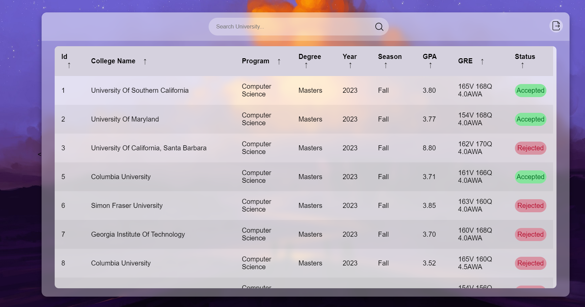

# Grad Admissions - For MS CS and PhD CS 

## Features of the website
1. You can search admits of colleges, and get a good idea of where your profile stands
2. The dataset is very large including admits from as early as 2007
3. The dataset is for MS in CS and for PhD in CS only
4. It has results from colleges from all around the world

## How the website was created?
1. The data used in the website is scraped from the internet, using python libraries like **BeautifulSoup** and **requests**
2. The website was made using **HTML**, **CSS** and **Javascript**
3. I used **d3.js** for extracting the search results from the **csv** file
4. All of this is rendered on the **front-end**
   
